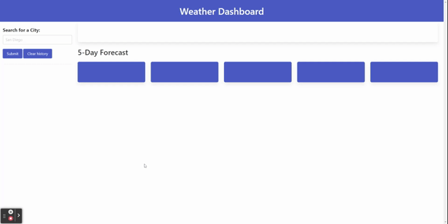

# WeatherDashboard

## Description 
In this web application, the user will be able to textually input a city name in order to receive the city;s current weather and 5 day forecast.

* Once the user inputs a city name, that ctiy's current and future conditions will display on the page and will be added to a search history.
* When the usr views the current weather conditions for that city, they will be presented with the city name, the date, an icon representation of weather conditions, the temperature, the humidity, the wind speed, and the UV index.
* When the user views the UV index, they are presented with a color that indicates whether the conditions are favorable, moderate, or severe.
* When the user views the future weather coditions for that city, they will be presented with a 5-day forecast that displays the date, an icon representation of weather conditions, the temperature, the wind speed, and the humidity.
* When the user clicks on a city in the search history, they are again presented with the currentand future conditions for that city. 

## Technologies used
* Openweathermap API
* Movement.js
* Bulma (CSS Framework)

## Example

## Link
* https://jmaraya1229.github.io/WeatherDashboard/?